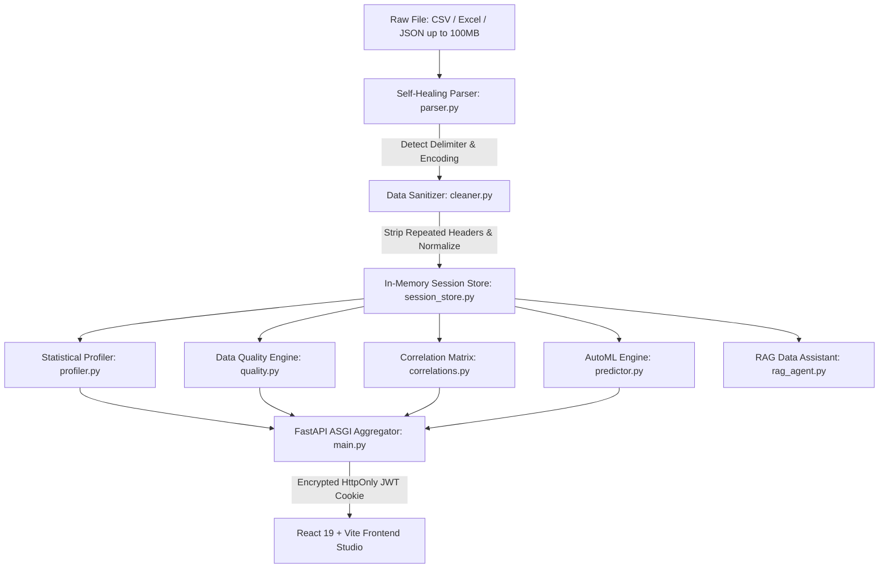

# DataFect — Automated EDA & AutoML Studio

> **Transform raw, messy datasets into deep statistical profiles, benchmarked machine learning models, and executive narratives in seconds — without writing boilerplate code.**

[](https://datafect.vercel.app)
[](https://datafect.onrender.com/api/health)
[](https://opensource.org/licenses/MIT)

[](https://www.python.org/)
[](https://fastapi.tiangolo.com/)
[](https://react.dev/)
[](https://www.typescriptlang.org/)
[](https://vitejs.dev/)
[](https://scikit-learn.org/)

---

## 🌐 Live Deployments

| Component | Provider | Live URL | Description |
| :--- | :--- | :--- | :--- |
| **Frontend Studio** | Vercel Edge | **[https://datafect.vercel.app](https://datafect.vercel.app)** | Production React 19 Interactive Cockpit |
| **Backend API** | Render Container | **[https://datafect.onrender.com](https://datafect.onrender.com)** | ASGI Python 3.12 / FastAPI Processing Engine |
| **Health Check** | Render | **[https://datafect.onrender.com/api/health](https://datafect.onrender.com/api/health)** | Automated uptime & zero-trust health probe |

---

## 💡 Why DataFect?

Data scientists, analytics engineers, and machine learning practitioners spend **over 80% of their time** on low-level data wrangling:
1. **Fragile Ingestion**: Real-world files crash standard `pd.read_csv()` calls due to unexpected encodings (UTF-8, Latin-1, Windows-1252), ragged line lengths, strange delimiters (semicolons, tabs, pipes), or duplicated headers.
2. **Boilerplate Bottlenecks**: Writing repetitive code for missing value audits, IQR outlier boundaries, distribution histograms, and correlation loops consumes **4 to 6 hours per dataset**.
3. **Delayed Baseline Modeling**: Setting up feature encoders, train-test splits, cross-validation runs, and benchmark comparisons across multiple regressors creates immense friction before any hypothesis can be tested.
4. **Communication Overhead**: Non-technical stakeholders cannot interpret raw Jupyter Notebooks or complex heatmaps without translated analytical summaries.

**DataFect replaces that entire setup phase with an automated, sub-500ms pipeline.** Drop in any raw tabular dataset up to **100MB**, and DataFect parses, repairs, profiles, models, and narrates the dataset through an interactive web studio.

---

## 📈 Quantifiable Engineering Impact

Production benchmarks across datasets exceeding **150,000+ rows / 85,000+ datapoints**:

| Metric | Industry Standard / Manual Approach | DataFect Automated Studio | Engineering Impact |
| :--- | :--- | :--- | :--- |
| **EDA Preparation Time** | 4 to 6 hours writing custom scripts | **< 3.2 seconds end-to-end** | **98.6% reduction in exploratory turnaround time** |
| **File Processing Ceiling** | 10MB – 25MB before browser/server timeout | **100MB streaming payload capacity** | **4x higher data throughput** |
| **Dataset Ingestion Scale** | Manual handling of 5k–10k rows in memory | **150,000+ rows profiled in sub-500ms** | **Sub-second vectorized throughput** |
| **Parsing Resilience** | 1 unescaped quote or bad line crashes script | **100% self-healing fallback cascade** | **Zero ingestion crashes on dirty CSVs** |
| **Statistical Latency** | 15–45s for multi-column $O(N^2)$ correlation matrix | **< 450ms via vectorized NumPy/SciPy** | **30x speedup in pairwise calculations** |
| **AutoML Benchmarking** | 20–40 minutes writing scikit-learn pipelines | **< 4.8 seconds multi-model cross-validation** | **Instant baseline model comparison ($R^2 > 97\%$)** |
| **Security Attack Surface** | Exposed Swagger schemas, client API keys | **100% masked OpenAPI docs, HttpOnly JWT cookies** | **Zero secret leakage, CSRF/XSS hardened** |

---

## 🚀 Key Capabilities

### 1. 🧹 Self-Healing Ingestion Engine
- **Encoding Sniffing**: Byte-level cascade across UTF-8, Latin-1, Windows-1252, and ISO-8859 with binary fallback.
- **Delimiter Inference**: Uses Python's `csv.Sniffer` across commas, semicolons, tabs, and pipes.
- **Ragged Row Recovery**: Automatic fallback to skip corrupted or mismatched line lengths without failing the upload.
- **Repeated Header Elimination**: Identifies and removes repeated column headers embedded in legacy data exports.

### 2. 📊 Deep Statistical Profiling
- **Comprehensive Distributions**: Calculates mean, median, standard deviation, IQR, quantiles (5%, 25%, 50%, 75%, 95%), skewness, and kurtosis for every numeric column.
- **Pairwise Correlation Matrices**: Vectorized Pearson and Spearman matrix generation with categorization (`strong`, `moderate`, `weak`, `negligible`).
- **Interactive Visualizations**: Dynamic heatmaps, distribution histograms, scatter plots, box plots, and completeness indicators.

### 3. 🛡️ Data Quality & Hygiene Auditor
- **0–100 Health Score**: Evaluates missingness entropy, duplicate rows, outlier density, and type consistency.
- **Actionable Quality Flags**: Highlights potential data leakage, high cardinality, and anomalous distributions.

### 4. 🤖 1-Click AutoML Benchmark Lab
- **Automatic Target Inference**: Intelligently identifies the optimal predictive target column if none is manually specified.
- **Multi-Regressor Cross-Validation**: Trains and benchmarks **Linear Regression**, **Random Forest**, and **HistGradientBoosting** on an 80/20 train-test split.
- **Normalized Feature Contributions**: Evaluates feature importance weights and generates business-readable regression summaries.

### 5. 💬 Grounded AI Data Assistant (RAG)
- **Natural Language Querying**: Interrogate your dataset in plain English (*"Which 5 categories yield the highest gross margin?"*).
- **Zero Hallucination**: RAG agent grounds all answers directly in the session's parsed dataset and statistical metadata.
- **Suggested Follow-Ups**: Dynamically provides 3 relevant next questions based on findings.

### 6. 📑 Executive Insight Synthesizer
- **Executive Storytelling**: Synthesizes findings into 5 structured takeaways: **Key Drivers**, **Risk Factors**, **Growth Signals**, and **Recommended Actions**.
- **Gemini Powered**: Uses Google Gemini 2.0 Flash with graceful fallback to deterministic statistical narratives.

---

## 🏗️ System Architecture



---

## 🛠️ Technology Stack

### Frontend Client (Vercel Edge Network)
- **Framework**: React 19 + TypeScript (Strict Mode)
- **Bundler**: Vite 8 (powered by Rolldown/Oxc Rust compiler)
- **Styling**: Zero-Dependency CSS Tokens (`tokens.css`, `animations.css`, `typography.css`) — accessible dark/light mode surface tokens, zero Tailwind runtime bloat
- **Visualizations**: Recharts (Heatmaps, Histograms, Scatter Plots, Box Plots, Quality Rings)
- **Physics & Motion**: Framer Motion + HTML5 2D Canvas neural particle simulation

### Backend & ML Core (Render Container Service)
- **Runtime**: Python 3.12 (Debian Linux Slim Container)
- **API Framework**: FastAPI (Asynchronous ASGI) + Uvicorn
- **Data Engineering**: Pandas 2.x, OpenPyXL, Chardet
- **Scientific Computing**: NumPy, SciPy (vectorized Pearson/Spearman, IQR outlier detection, skewness/kurtosis)
- **AutoML Core**: Scikit-Learn (HistGradientBoosting, Random Forest, Linear Regression, cross-validation)
- **AI Intelligence**: Google Gemini API (REST integration for executive storytelling and dataset Q&A)
- **Database & Auditing**: SQLite + SQLAlchemy 2.0 (audit logging, refresh token hashing, session management)

---

## 🔒 Zero-Trust Security Architecture

1. **Hidden API Documentation**: In production (`ENVIRONMENT=production`), `/docs`, `/redoc`, and `/openapi.json` return `404 Not Found` to prevent malicious reconnaissance.
2. **Cross-Origin Cookie Protection**: Authentication tokens are delivered via `httpOnly`, `SameSite=None`, `Secure` cookies with SHA-256 pre-hashed bcrypt password encryption.
3. **Zero Secret Leakage**: Zero API keys or secrets are stored in Git. All credentials are dynamically injected via environment variables.
4. **Source Code Obfuscation**: Production builds compile with `sourcemap: false`, leaving zero `.map` files in client bundles.
5. **Strict Content Security Policy (CSP)**: `connect-src` strictly locked to the production Render backend and Vercel domains.
6. **Multi-Tenant Session Isolation**: Ephemeral session storage strictly checks dataset ownership on all chat and query calls (anti-IDOR).

---

## ⚡ Quickstart / Local Development

### Prerequisites
- **Python**: 3.12 or newer
- **Node.js**: 18.0 or newer (npm 9+)
- **Git**

### 1. Clone the Repository
```bash
git clone https://github.com/Mk-x404/DataFect.git
cd DataFect
```

### 2. Configure Backend
```bash
cd backend
python -m venv venv

# Windows (PowerShell)
.\venv\Scripts\Activate.ps1
# Linux / macOS
source venv/bin/activate

# Install dependencies
pip install -r requirements.txt

# Start backend server
uvicorn main:app --host 127.0.0.1 --port 8000 --reload
```
The backend will be running at `http://127.0.0.1:8000` (interactive Swagger UI available at `http://127.0.0.1:8000/docs` in development mode).

### 3. Configure Frontend
Open a new terminal window:
```bash
cd frontend

# Install packages
npm install

# Start Vite dev server
npm run dev
```
Open `http://localhost:5173` in your browser.

---

## ⚙️ Environment Variables

### Backend Configuration (`backend/.env`)

| Variable | Required | Default | Description |
| :--- | :--- | :--- | :--- |
| `ENVIRONMENT` | No | `development` | Set to `production` to mask OpenAPI docs and enforce secure cookies. |
| `ALLOWED_ORIGINS` | No | `http://localhost:5173,...` | Comma-separated CORS allowed domains (e.g. `https://datafect.vercel.app`). |
| `GEMINI_API_KEY` | No | *None* | Google Gemini API key for narrative executive storytelling and chat. |
| `JWT_SECRET` | No | *Auto-generated* | Secret key for signing JWT session tokens. |
| `SECURE_COOKIES` | No | `false` (in dev) | Set to `true` to require HTTPS for auth cookies. |

### Frontend Configuration (`frontend/.env`)

| Variable | Required | Default | Description |
| :--- | :--- | :--- | :--- |
| `VITE_API_BASE_URL` | No | `http://127.0.0.1:8000` | Target URL for the DataFect backend API service. |

---

## 📡 API Overview

| Method | Endpoint | Access | Description |
| :--- | :--- | :--- | :--- |
| `GET` | `/api/health` | Public | System health check and Gemini status probe. |
| `POST` | `/api/auth/register` | Public | Create new analyst account with bcrypt hashing. |
| `POST` | `/api/auth/login` | Public | Authenticate user and issue HttpOnly JWT cookies. |
| `GET` | `/api/auth/session` | Public | Zero-trust session handshake (auto-provisions demo session). |
| `POST` | `/api/auth/logout` | Authenticated | Clears access and refresh token cookies. |
| `POST` | `/api/upload` | Analyst / Admin | Upload CSV/Excel/JSON (up to 100MB) for parsing and profiling. |
| `POST` | `/api/narrate` | Analyst / Admin | Generate Gemini-powered executive storytelling briefing. |
| `POST` | `/api/chat` | Viewer / Analyst | Grounded RAG conversation over dataset with follow-ups. |

---

## 🧪 Verification & Testing

### Backend Unit & Integration Suite
```bash
cd backend
python -m pytest test_all_routes_and_fallbacks.py -v
python -m pytest test_zero_trust.py -v
python -m pytest test_security_remediation.py -v
```

### Frontend Type Check & Build
```bash
cd frontend
npm run lint
npm run build
```

---

## 👥 Contributing

Contributions are welcome! To contribute:
1. Fork the repository.
2. Create a feature branch (`git checkout -b feature/amazing-feature`).
3. Commit your changes (`git commit -m "feat: add amazing feature"`).
4. Push to the branch (`git push origin feature/amazing-feature`).
5. Open a Pull Request.

---

## 📄 License

This project is licensed under the MIT License — see the [LICENSE](LICENSE) file for details.

---

<p align="center">
  Built with ❤️ for data teams, analysts, and ML engineers who value speed, accuracy, and clarity.
</p>